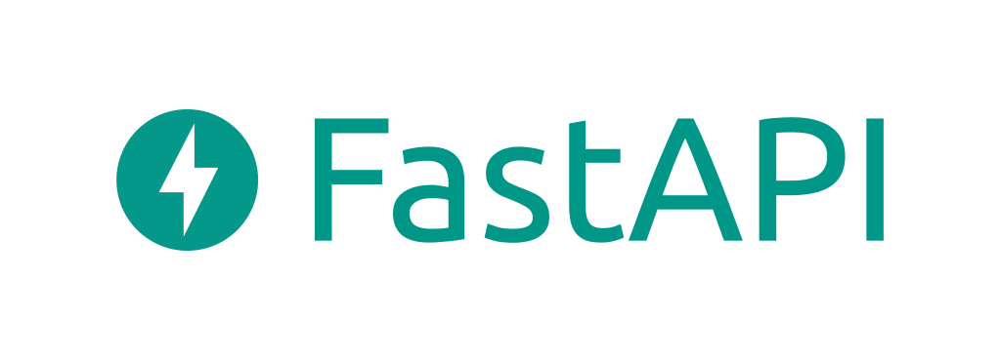

# FastAPI



## Task: Create you own API 
It should contain at least the following requirements:

* A route that handles GET request
* A route that handles POST request
* A route that takes a number in the request and returns this number multiplied by 2
* A POST route that takes this dictionary (in `json` format) and returns the computation of `salary + bonus - taxes`.
    * Make sure to return an error if the user enters a string instead  of a number.
    * Make sure the user sends the 3 fields.

**Input:**
```json
{
    "salary": 2500,
    "bonus": 200,
    "taxes": 400
}
```

**Outputs:**

If the user enters a valid input:
```json
{
    "result": 2300 // salary + bonus - taxes
}
```
If the user enters a string:
```json
{
    "error": "expected numbers, got strings."
}
```
If the user forgets a field:
```json
{
    "error": f"3 fields expected (salary, bonus, taxes). You forgot: {FIELD_THE_USER_FORGOT_HERE}."
}
```

## Test you API

To test you API you can use you browser or the `curl` command in the terminal (if you are using an older version of Windows < 10 you can [install](https://www.wikihow.com/Install-Curl-on-Windows) the curl command). 

But if you want to test POST requests with some data in it and start to work on a complex API then you will need a more advanced tool!

We recommend you to check [Postman](https://www.postman.com/) which is a free software compatible with Windows, Linux and Mac. It allows you to create and register complex requests, to add headers, to get formatted data and much more.


Are you done? If yes, you know how a basic API works, and how to put it in production. Congratulations!

