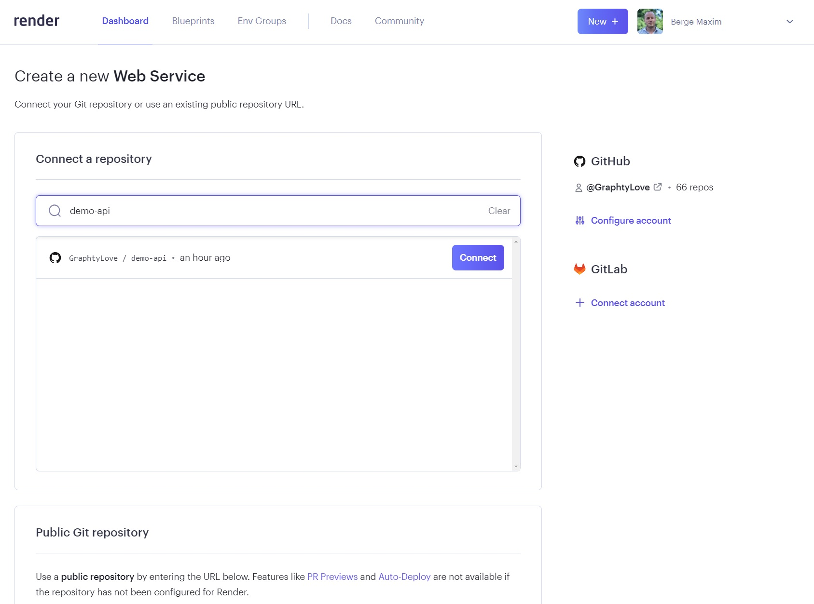
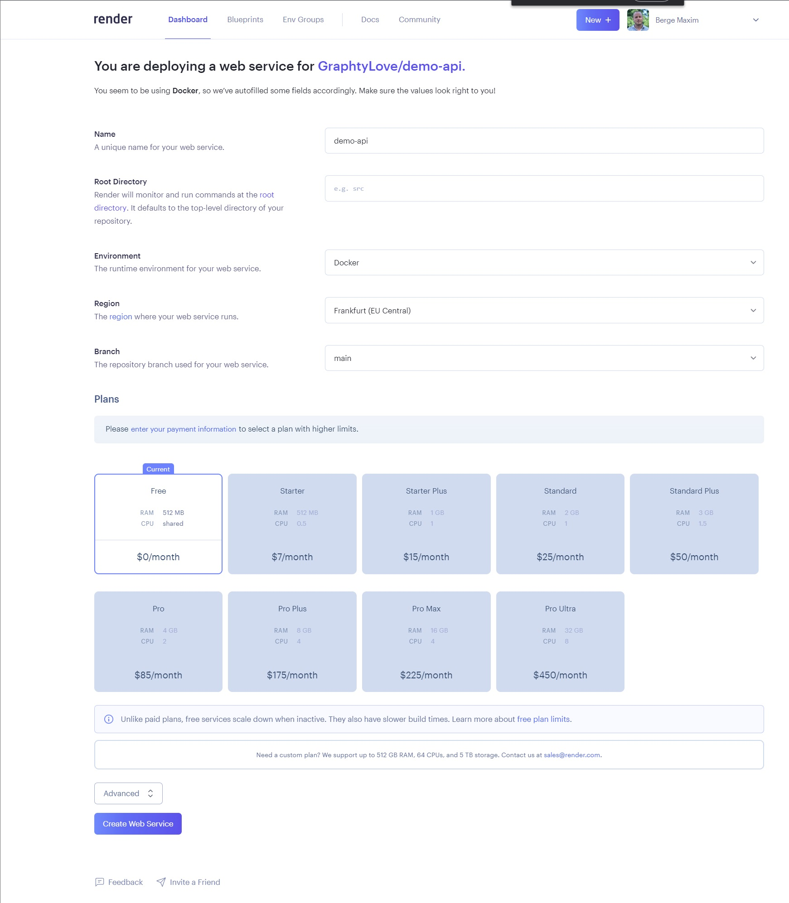

# Render

[Render](https://render.com/) is a cloud service that allows you to deploy your code online.

## Deploy an API with Docker

Let's see how we can deploy an API using Git, Render and Docker (mainly, a DockerFile). 

**Note:** You will explore Docker in depth later on! We will focus on only the DockerFile, for now...

### 1. Create the Github repository

Let's create a GitHub reposity. the name doesn't matter.

### 2. Clone the repo on your local machine

You know how to do that.

### 3. Create the files for our API

We will create the code for our API. Let's keep that at the root of the repo.

You can find a [repository will all the files here](https://github.com/GraphtyLove/demo-api).

`app.py`
```python
from fastapi import FastAPI
import os

# Set port to the env variable PORT to make it easy to choose the port on the server
# If the Port env variable is not set, use port 8000
PORT = os.environ.get("PORT", 8000)
app = FastAPI(port=PORT)


@app.get("/")
async def root():
    """Route that return 'Alive!' if the server runs."""
    return {"Status": "Alive!"}


@app.get("/hello")
async def say_hello(user: str = "Anonymous"):
    """Route that will return 'hello {user}'."""
    return {"Message": f"Hello {user}!"}
```

`Dockerfile`
```Dockerfile
# Starts from the python 3.10 official docker image
FROM python:3.10

# Create a folder "app" at the root of the image
RUN mkdir /app

# Define /app as the working directory
WORKDIR /app

# Copy all the files in the current directory in /app
COPY . /app

# Update pip
RUN pip install --upgrade pip

# Install dependencies from "requirements.txt"
RUN pip install -r requirements.txt

# Run the app
# Set host to 0.0.0.0 to make it run on the container's network
CMD uvicorn app:app --host 0.0.0.0
```

`requirements.txt`
```
fastapi==0.85.0
uvicorn==0.18.3
```

### 4. Push the changes to the repository

```bash
git add .
git commit -m 'First commit'
git push
```

### 5. Login on Render

Create an account if you don't have one on [Render](https://render.com/), then Login.

### 6. Create a new Web Service

In the dashboard, click on `New` -> `Web Service`.


### 7. Connect to your GitHub account

Provide your credentials.

### 8. Chose the repository

Find the repository you want to deploy and click on `connect`.



### 9. Configure

You have few configuration options:

- A name for you API
- A runtime (should be `Docker`)
- A region (choose `EU`)
- A branch (defualt is `main`)
- A plan (choose `Free`)

Then click on `Create Web Service`!



### 10. Wait for your API to be deployed

You can follow the deployement with the logs displayed.

### 11. Access your API

You should be good to go! You can see your API's URL in the dashboard.


### 12. Maintain

Having a bug? A typo?

Good for you, Render is synced with your Github repository. 
Each time you are gonna push on main, your API will be re-deployed.

Handy right?

### 13. Go grab an ice cream

You deserve it.

